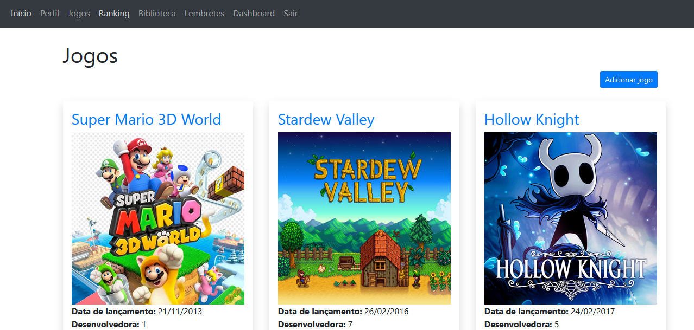
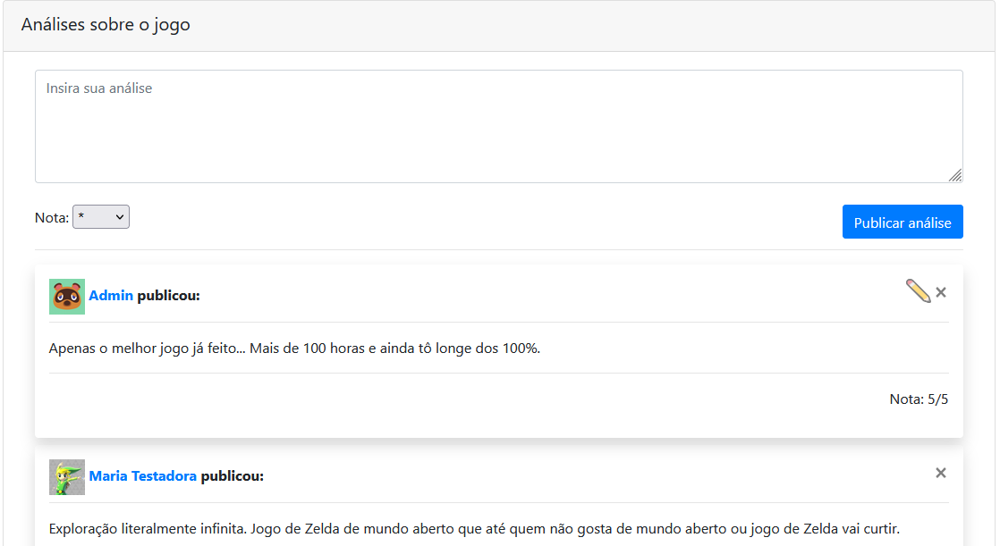
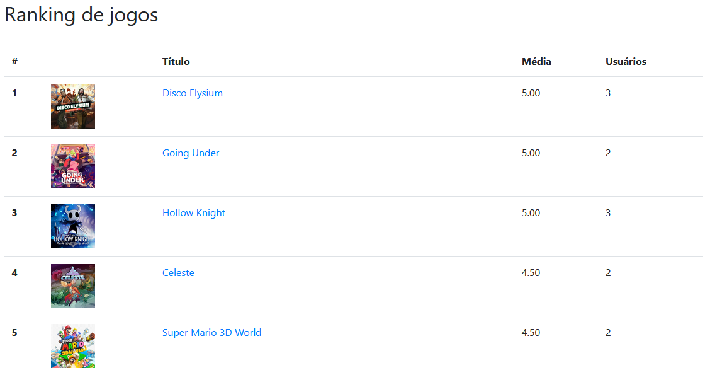
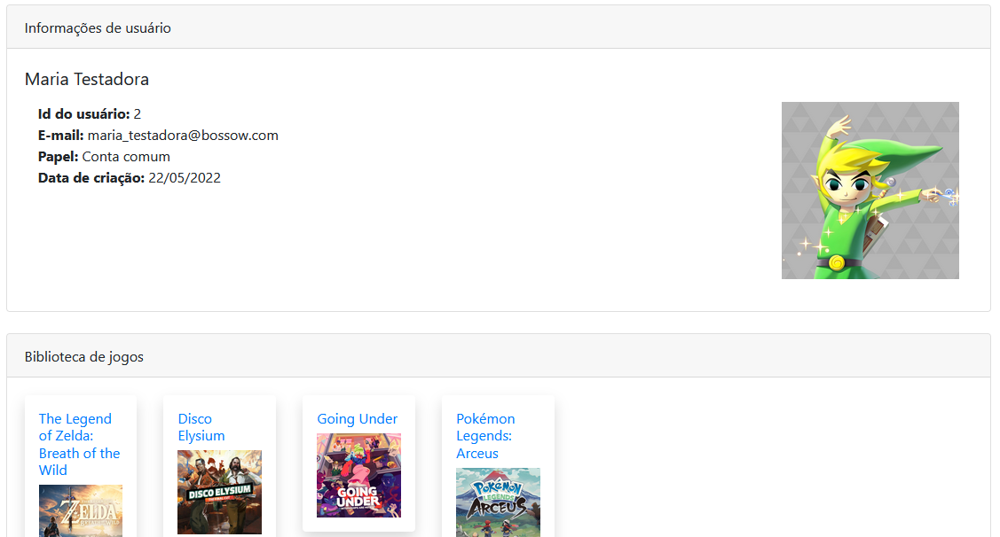

# (BD - 2021.2): Bossow, rede social de jogos
Projeto final da disciplina de Bancos de Dados, ofertada na Universidade de Brasília (UnB) no semestre 2021.2.

## Preparação do ambiente

O projeto foi feito utilizando o banco de dados MySQL. O primeiro passo para rodar o Bossow é executar os scripts SQL para criação e população do banco de dados.

Primeiro, rode o script `cria_banco.sql`. Depois, é necessário popular o banco. Como há dados binários de imagens, é preciso colocar as imagens que serão usadas no banco na pasta de uploads do SGBD.

Para tanto, execute o comando abaixo, que indicará a pasta onde as imagens podem ser colocadas:

`
SELECT @@secure_file_priv;
`

Com o diretório dado por esse comando, altere o script `popula_banco.sql` substituindo `to_be_set\\` pelo diretório encontrado (no Windows, o endereço precisa ser escapado com uma barra a mais \). Transfira todas as imagens na pasta data para o diretório indicado pelo SGBD. Com isso, execute o script.

## Executando o projeto

O site foi feito utilizando Flask. Para executá-lo, é necessário primeiro alterar o script `config.py`, inserindo as informações do banco MySQL que está rodando o banco (MYSQL_USER e MYSQL_PASSWORD precisam ser alterados).

Depois, basta executar o comando

`
python run.py
`

O site poderá ser acessado através da URL: `http://127.0.0.1:5000/`.

## Interface com usuário

A interface permite a interação com as entidades de usuário, jogo, avaliações, reclamações, lembretes e imagens.

O acesso à biblioteca geral de jogos do Bossow é livre para qualquer pessoa (mesmo as não autenticadas), resultando na tela abaixo.

<p align="center"></p>

Cada jogo tem sua tela própria, onde é possível que os usuários logados façam avaliações, com notas, assim como façam reclamações para os administradores, pedindo alterações na página.

<p align="center"></p>

As notas dadas nas avaliações dos usuários são então usadas como base para o ranking de jogos cadastrados na plataforma.

<p align="center"></p>

As informações gerais de cada usuário podem ser acessadas na sua página de perfil, onde há informações sobre a conta, jogos adquiridos e avaliações publicadas.

<p align="center"></p>

Outras telas foram implementadas.

## Usuários de teste

O banco já está populado com vários perfis de teste. No entanto, os dois perfis básicos para testar os acessos ao site são os seguintes, com as permissões de administrador e usuário comum, respectivamente:

```
E-mail: admin@bossow.com
Senha: admin123
```

```
E-mail: luigi_fantasma@bossow.com
Senha: teste123
```
